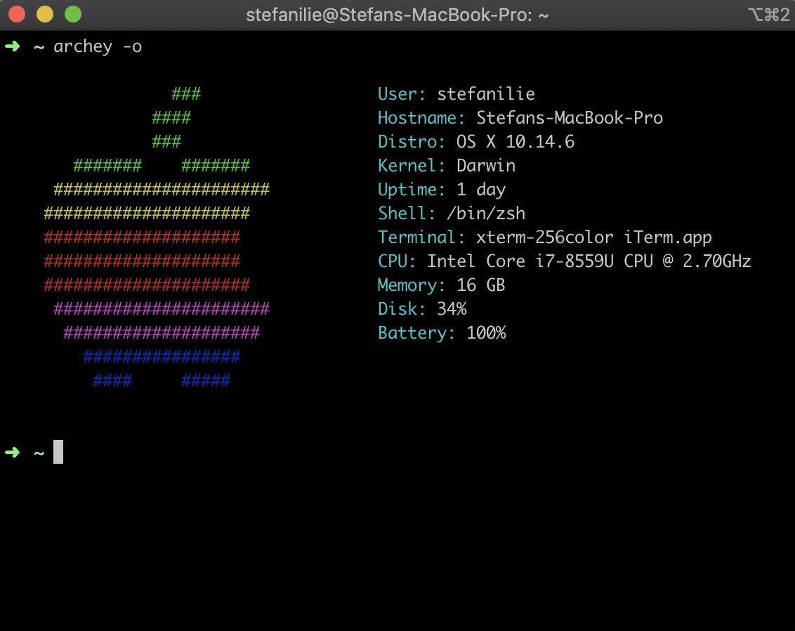

  

# dotfiles.

Actually, mostly just shell scripts. react-native focused.

### Installation

Clone the repo and cherry pick whatever you want.

Requires Xcode to work.

### Features

- Initialises macOS (and some apps) with opinionated defaults
- Installs `brew` if not present, as well as some CLI apps, GUI apps, Mac App Store apps
- Configures `vscode`
- Dependencies for react-native development.

### Credits

- [Theodor Vararu](https://github.com/tvararu)
- [Mathias Bynens](https://github.com/mathiasbynens/dotfiles)
- [Steve Losh](https://bitbucket.org/sjl/dotfiles/src/e8ba45f413665278c11f2de3a1d67a1da3832d34/osx.sh?at=default)
- [Gary Bernhardt](https://github.com/garybernhardt/dotfiles)
- [vladh](https://github.com/vladh/dotfiles)
- [secrets.blacktree.com](http://secrets.blacktree.com) (RIP)

### License

MIT.